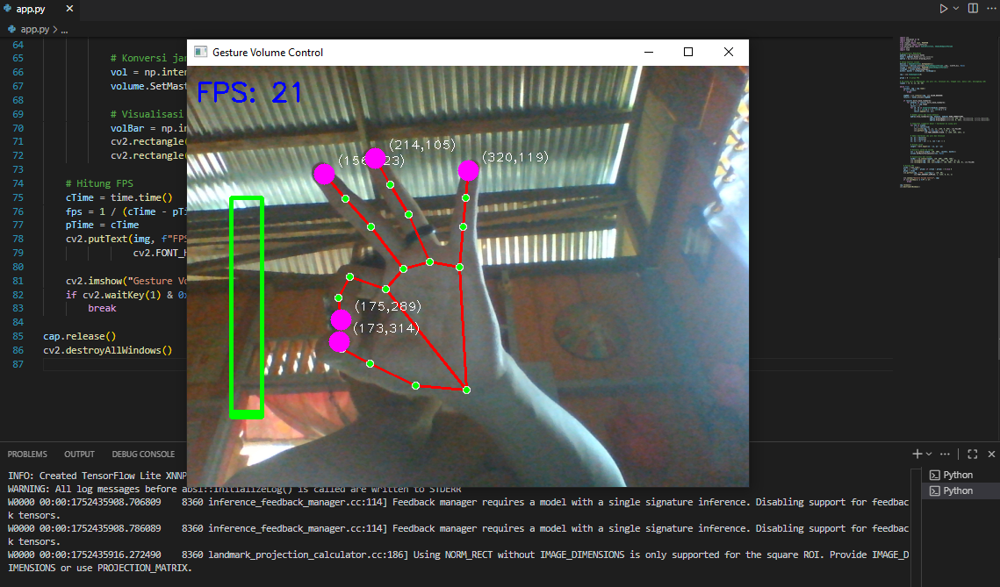

## 🎛 Gesture Volume Control with Mediapipe & OpenCV
## 📌 Project Description
Gesture Volume Control is a Python-based application that allows users to control their computer's volume simply by gesturing with their hands in front of the camera.
This application utilizes MediaPipe Hands to detect hand landmarks and then measures the distance between the thumb and index finger as a reference for volume.
Volume control is performed through PyCaw, which interacts directly with the Windows audio system.

## ✨ Key Features
- Real-time Volume Control — slide the distance between your thumb and index finger to adjust the volume.
- Accurate Hand Detection — uses MediaPipe with a model optimized for single hands.
- Fingertip Coordinates — each fingertip is labeled (x, y) on the screen.
- Volume Indicator — a visual bar that moves up and down as the finger distance changes.
- FPS Monitoring — displays FPS to ensure optimal camera performance.
- Hand Skeleton Visualization — green lines and red dots for each hand joint.

## 🛠 Technology Used
- OpenCV Captures and processes video from a camera
- MediaPipe Hands Detects hand landmarks in real-time
- NumPy Mathematical calculations and value interpolation
- PyCaw Volume control on Windows operating systems
- Comtypes Interacts with Windows APIs via COM

## 🏗 Program Architecture
- Video Capture : The camera captures video frames using cv2.VideoCapture().
- Landmark Detection : The frames are processed with MediaPipe Hands to obtain 21 landmark points.
- Distance Calculation : The program takes the coordinates of landmarks ID 4 (thumb) and ID 8 (index finger) and calculates the distance using math.hypot().
- Volume Interpolation : The distance values are converted to the system volume scale using numpy.interp().
- System Volume Control : The volume is controlled through the PyCaw API.
- Visualization : Displaying connecting lines between hand points Circles and coordinate labels at the fingertips, FPS in the upper left corner, Volume bar on the left side of the screen.

## 🚀 Installing and Running the Program
### 1. Clone Repository
```bash
git clone https://github.com/404-mind72/Gesture-Volume-Control-with-Mediapipe-OpenCV.git
```
### 2. Install Dependencies
```bash
pip install opencv-python mediapipe numpy pycaw comtypes
```
### 3. Run The Program
```bash
python run app.py
```
## 📖 How to Use
1. Make sure the camera is on and pointing at your hand.
2. Short distance between thumb and index finger → Low volume
3. Long distance → High volume
4. The coordinates of your fingertip will appear on the screen to aid observation.
5. Press ESC to exit the program.

## 🎥 View Output
- Initial view


- Usage output


## 💡 Further Development Ideas
- Adding mute/unmute gestures with specific hand poses.
- Supporting multi-hand detection for stereo control.
- Integration with media player controls (pause, play, next).
- Adding a graphical UI using Tkinter or PyQt.

## 🚩Contributions
I would appreciate contributions to improve the model, add or enhance features, and optimize the deployment process. For any queries, reach out to me at joni150703@gmail.com

📄 License
This project is licensed under the MIT License.
Free to use, modify, and distribute.

